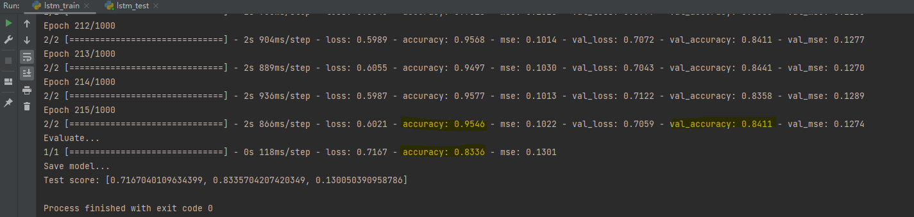
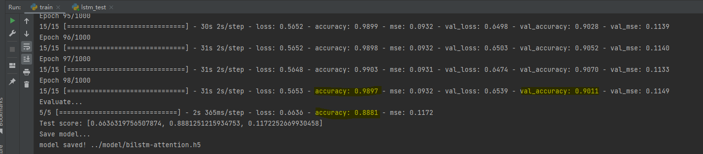
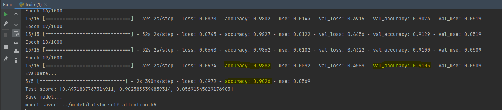

## 基于三分类的文本情感分析

### 1. 背景介绍

文本情感分析作为NLP的常见任务，具有很高的实际应用价值。本文将采用LSTM模型，训练一个能够识别文本postive, neutral, negative三种情感的分类器。

### 2. LSTM三分类模型

代码需要注意的几点是，第一是，标签需要使用keras.utils.to_categorical来yummy，第二是LSTM二分类的参数设置跟二分有区别，选用softmax，并且loss函数也要改成categorical_crossentropy.

#### 环境依赖
`pip install -r requirements.txt`
#### 训练
`python lstm/lstm_train.py`

#### 测试
`python lstm/lstm_test.py`

### 3. BiLSTM + Attention
#### 训练
`python bilstm-attention/train.py`

#### 测试
`python bilstm-attention/test.py`

### 4. BiLSTM + Self-Attention
#### 训练
`python bilstm-self-attention/train.py`

#### 测试
`python bilstm-self-attention/test.py`

### -1. 说明
代码和数据来源于：[Edward1Chou/SentimentAnalysis](https://github.com/Edward1Chou/SentimentAnalysis)，在基础上做了一些改动。
- 环境由 python2 改为 python3
- 加入 EarlyStopping
- 加入 BiLSTM + Attention -> bilstm-attention/train.py
- 加入 Self-Attention
- ...
